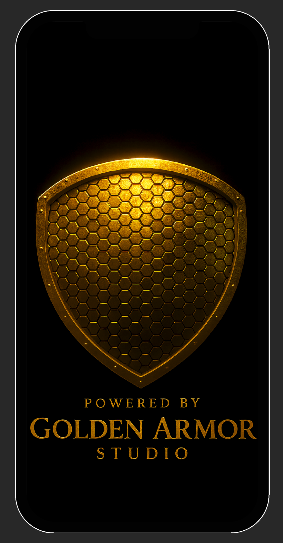
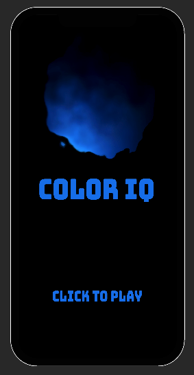
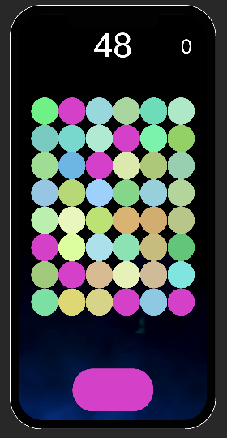

# Color IQ – Rise Through the Spectrum

<p align="center">
  
  
  
</p>


Color IQ is a fast–paced color perception challenge built with Unity. Match target hues, chase the leaderboard, and share your score with the world. This repository contains the production project for the Golden Armor Studio mobile release.

## What You'll Find Here

- 🎯 **Core Gameplay Scripts** – `GameController`, `GameBoard`, and `ColorGamePiece` drive the matching loop and progression.
- 🎨 **Procedural Visuals** – Smart sprite scaling keeps art crisp across devices.
- 📣 **Social Sharing Flow** – Automated screenshot capture + native iOS share sheet glue for brag–worthy posts.
- 💰 **Unity Ads Integration** – Banner placement scaffolding with a bonus tile trigger.
- 🧭 **Splash → Start Flow** – A polished entry experience with adaptive timing and camera–aware scaling.

## Getting Started

### Prerequisites

- **Unity** 2022.3 LTS (URP profile included).
- **Xcode** (latest) for iOS builds.
- Apple Developer account + App Store Connect entry (update the `AppStoreUrl` constant in `ShareIQController`).

### Project Setup

```bash
# Clone the project
$ git clone https://github.com/your-org/color-iq.git
$ cd color-iq

# Open in Unity Hub and target iOS platform
```

1. Launch the project in Unity.
2. Open `Assets/Scenes/GameScene.unity` to iterate on gameplay.
3. Run `ShareIQScene.unity` to customize the post-game experience.

### Build & Deploy

1. Switch build target to **iOS**.
2. Ensure Ad IDs, share URLs, and signing profiles are configured.
3. `Build & Run` to Xcode, then archive for submission.


## Contributing & Collaboration

We’re always excited to work with designers, artists, and fellow engineers who love stylish puzzle games.

- 🌐 **Studio Website**: [goldenarmorstudio.art](https://goldenarmorstudio.art)
- 💬 **Discord**: [Join the Golden Armor Studio community](https://discord.gg/cTDGryK7)

### How to Propose Changes

1. Fork / feature branch (`feat/my-awesome-improvement`).
2. Follow the existing code style (C# scripts under `Assets/Scenes` and `Assets/Scripts`).
3. Submit a PR with:
   - Summary of the change.
   - Screenshots / GIFs if visuals are impacted.
   - Test notes (device, resolution, etc.).

## Project Structure (Highlights)

```
Assets/
 ├─ Scenes/                 # Core gameplay & UI scenes
 ├─ Scripts/                # Share integrations & helpers
 ├─ Resources/              # Splash art & share assets
 └─ Plugins/iOS/            # Native share sheet bridge
Docs/
 └─ readme-*.png            # README imagery
```

## Roadmap Ideas

- ✅ Native iOS share cards
- 🔄 Additional power-ups & level themes
- 🔜 Game Center leaderboards
- 🧪 Color accessibility modes

If any of that sparks your interest, say hi on Discord or drop us a note via the website. Let’s build something vibrant together!

---
*Color IQ is a Golden Armor Studio project. All trademarks referenced are the property of their respective owners.*
